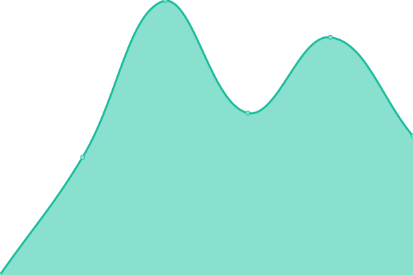
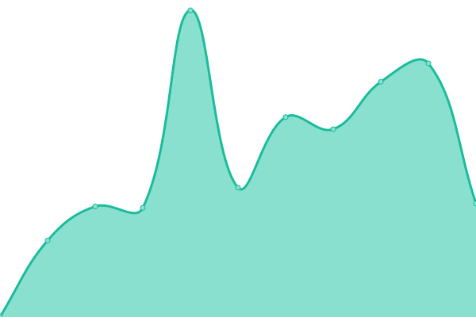

# [📈 Live Status](https://AI4EOSC.github.io/status): <!--live status--> **🟧 Partial outage**

This repository contains the open-source uptime monitor and status page for [AI4EOSC](http://ai4eosc.eu), powered by [Upptime](https://github.com/upptime/upptime).

With [Upptime](https://upptime.js.org), you can get your own unlimited and free uptime monitor and status page, powered entirely by a GitHub repository. We use [Issues](https://github.com/AI4EOSC/status/issues) as incident reports, [Actions](https://github.com/AI4EOSC/status/actions) as uptime monitors, and [Pages](https://AI4EOSC.github.io/status) for the status page.

<!--start: status pages-->
<!-- This summary is generated by Upptime (https://github.com/upptime/upptime) -->
<!-- Do not edit this manually, your changes will be overwritten -->
<!-- prettier-ignore -->
| URL | Status | History | Response Time | Uptime |
| --- | ------ | ------- | ------------- | ------ |
|  [Dashboard (AI4EOSC)](https://dashboard.cloud.ai4eosc.eu) | 🟩 Up | [dashboard-ai-4-eosc.yml](https://github.com/AI4EOSC/status/commits/HEAD/history/dashboard-ai-4-eosc.yml) | 

 1217ms
     
 | 

<a href="https://status.ai4eosc.eu/history/dashboard-ai-4-eosc">98.62%</a>
    

|  [Dashboard (iMagine)](https://dashboard.cloud.imagine-ai.eu) | 🟩 Up | [dashboard-i-magine.yml](https://github.com/AI4EOSC/status/commits/HEAD/history/dashboard-i-magine.yml) | 

 1243ms
     
 | 

<a href="https://status.ai4eosc.eu/history/dashboard-i-magine">98.67%</a>
    

|  [Dashboard (AI4Life)](https://dashboard.cloud.ai4eosc.eu) | 🟩 Up | [dashboard-ai-4-life.yml](https://github.com/AI4EOSC/status/commits/HEAD/history/dashboard-ai-4-life.yml) | 

 1159ms
     
 | 

<a href="https://status.ai4eosc.eu/history/dashboard-ai-4-life">98.71%</a>
    

|  [Dashboard (tutorials)](https://tutorials.cloud.ai4eosc.eu) | 🟩 Up | [dashboard-tutorials.yml](https://github.com/AI4EOSC/status/commits/HEAD/history/dashboard-tutorials.yml) | 

 1228ms
     
 | 

<a href="https://status.ai4eosc.eu/history/dashboard-tutorials">98.76%</a>
    

|  [Homepage](https://ai4eosc.eu) | 🟥 Down | [homepage.yml](https://github.com/AI4EOSC/status/commits/HEAD/history/homepage.yml) | 

 1218ms
     
 | 

<a href="https://status.ai4eosc.eu/history/homepage">97.75%</a>
    

|  [LLM4EOSC Chat](https://chat.cloud.ai4eosc.eu/) | 🟩 Up | [llm-4-eosc-chat.yml](https://github.com/AI4EOSC/status/commits/HEAD/history/llm-4-eosc-chat.yml) | 

 853ms
     
 | 

<a href="https://status.ai4eosc.eu/history/llm-4-eosc-chat">98.86%</a>
    

|  [LLM4EOSC LiteLLM (federated)](https://vllm.cloud.ai4eosc.eu/) | 🟩 Up | [llm-4-eosc-lite-llm-federated.yml](https://github.com/AI4EOSC/status/commits/HEAD/history/llm-4-eosc-lite-llm-federated.yml) | 

 794ms
     
 | 

<a href="https://status.ai4eosc.eu/history/llm-4-eosc-lite-llm-federated">98.90%</a>
    

|  [LLM4EOSC LiteLLM (IFCA)](https://ifca01-vllm.cloud.ai4eosc.eu/) | 🟥 Down | [llm-4-eosc-lite-llm-ifca.yml](https://github.com/AI4EOSC/status/commits/HEAD/history/llm-4-eosc-lite-llm-ifca.yml) | 

 794ms
     
 | 

<a href="https://status.ai4eosc.eu/history/llm-4-eosc-lite-llm-ifca">38.75%</a>
    

|  [LLM4EOSC LiteLLM (IFCA)](https://iisas01-vllm.cloud.ai4eosc.eu) | 🟥 Down | [llm-4-eosc-lite-llm-ifca.yml](https://github.com/AI4EOSC/status/commits/HEAD/history/llm-4-eosc-lite-llm-ifca.yml) | 

 794ms
     
 | 

<a href="https://status.ai4eosc.eu/history/llm-4-eosc-lite-llm-ifca">38.75%</a>
    

|  [Module template generator](https://templates.cloud.ai4eosc.eu/) | 🟥 Down | [module-template-generator.yml](https://github.com/AI4EOSC/status/commits/HEAD/history/module-template-generator.yml) | 

 0ms
     
 | 

<a href="https://status.ai4eosc.eu/history/module-template-generator">0.00%</a>
    

|  [Storage (NextCloud)](https://share.cloud.ai4eosc.eu) | 🟩 Up | [storage-next-cloud.yml](https://github.com/AI4EOSC/status/commits/HEAD/history/storage-next-cloud.yml) | 

 1819ms
     
 | 

<a href="https://status.ai4eosc.eu/history/storage-next-cloud">99.00%</a>
    

|  [MLflow (AI4EOSC)](https://mlflow.cloud.ai4eosc.eu/) | 🟩 Up | [m-lflow-ai-4-eosc.yml](https://github.com/AI4EOSC/status/commits/HEAD/history/m-lflow-ai-4-eosc.yml) | 

 565ms
     
 | 

<a href="https://status.ai4eosc.eu/history/m-lflow-ai-4-eosc">100.00%</a>
    

|  [MLflow (iMagine)](https://mlflow.cloud.imagine-ai.eu/) | 🟩 Up | [m-lflow-i-magine.yml](https://github.com/AI4EOSC/status/commits/HEAD/history/m-lflow-i-magine.yml) | 

 1001ms
     
 | 

<a href="https://status.ai4eosc.eu/history/m-lflow-i-magine">100.00%</a>
    

|  [CI/CD (Jenkins)](https://jenkins.services.ai4os.eu/) | 🟩 Up | [ci-cd-jenkins.yml](https://github.com/AI4EOSC/status/commits/HEAD/history/ci-cd-jenkins.yml) | 

 2332ms
     
 | 

<a href="https://status.ai4eosc.eu/history/ci-cd-jenkins">99.05%</a>
    

|  [Provenance](https://provenance.cloud.ai4eosc.eu/) | 🟩 Up | [provenance.yml](https://github.com/AI4EOSC/status/commits/HEAD/history/provenance.yml) | 

 766ms
     
 | 

<a href="https://status.ai4eosc.eu/history/provenance">99.10%</a>
    

|  [MinIO object storage - Provider UPV/GRyCAP](https://console-minio-inference.cloud.ai4eosc.eu) | 🟩 Up | [min-io-object-storage-provider-upv-g-ry-cap.yml](https://github.com/AI4EOSC/status/commits/HEAD/history/min-io-object-storage-provider-upv-g-ry-cap.yml) | 

 644ms
     
 | 

<a href="https://status.ai4eosc.eu/history/min-io-object-storage-provider-upv-g-ry-cap">100.00%</a>
    

|  [OSCAR - Provider UPV/GRyCAP](https://inference.cloud.ai4eosc.eu) | 🟩 Up | [oscar-provider-upv-g-ry-cap.yml](https://github.com/AI4EOSC/status/commits/HEAD/history/oscar-provider-upv-g-ry-cap.yml) | 

 1190ms
     
 | 

<a href="https://status.ai4eosc.eu/history/oscar-provider-upv-g-ry-cap">100.00%</a>
    

|  [Platform API](https://api.cloud.ai4eosc.eu) | 🟩 Up | [platform-api.yml](https://github.com/AI4EOSC/status/commits/HEAD/history/platform-api.yml) | 

 570ms
     
 | 

<a href="https://status.ai4eosc.eu/history/platform-api">99.14%</a>
    

|  [Nomad cluster](193.146.75.205) | 🟩 Up | [nomad-cluster.yml](https://github.com/AI4EOSC/status/commits/HEAD/history/nomad-cluster.yml) | 

 128ms
     
 | 

<a href="https://status.ai4eosc.eu/history/nomad-cluster">99.19%</a>
    

|  [Docker Registry (Harbor)](https://registry.cloud.ai4eosc.eu) | 🟩 Up | [docker-registry-harbor.yml](https://github.com/AI4EOSC/status/commits/HEAD/history/docker-registry-harbor.yml) | 

 1151ms
     
 | 

<a href="https://status.ai4eosc.eu/history/docker-registry-harbor">100.00%</a>
    

|  [AI4EOSC Helpdesk](https://helpdesk.cloud.ai4eosc.eu/) | 🟩 Up | [ai-4-eosc-helpdesk.yml](https://github.com/AI4EOSC/status/commits/HEAD/history/ai-4-eosc-helpdesk.yml) | 

 589ms
     
 | 

<a href="https://status.ai4eosc.eu/history/ai-4-eosc-helpdesk">99.23%</a>
    

|  [Provider IFCA-LCG2 org.openstack.nova](https://api.cloud.ifca.es:5000/v3) | 🟩 Up | [provider-ifca-lcg-2-org-openstack-nova.yml](https://github.com/AI4EOSC/status/commits/HEAD/history/provider-ifca-lcg-2-org-openstack-nova.yml) | 

 435ms
     
 | 

<a href="https://status.ai4eosc.eu/history/provider-ifca-lcg-2-org-openstack-nova">96.73%</a>
    

|  [Provider NCG-INGRID-PT (INCD) org.openstack.nova](https://stratus.a.acnca.pt:5000/v3) | 🟩 Up | [provider-ncg-ingrid-pt-incd-org-openstack-nova.yml](https://github.com/AI4EOSC/status/commits/HEAD/history/provider-ncg-ingrid-pt-incd-org-openstack-nova.yml) | 

 548ms
     
 | 

<a href="https://status.ai4eosc.eu/history/provider-ncg-ingrid-pt-incd-org-openstack-nova">100.00%</a>
    

|  [Provider IISAS-FedCloud org.openstack.nova](https://cloud.ui.savba.sk:5000/v3) | 🟩 Up | [provider-iisas-fed-cloud-org-openstack-nova.yml](https://github.com/AI4EOSC/status/commits/HEAD/history/provider-iisas-fed-cloud-org-openstack-nova.yml) | 

 655ms
     
 | 

<a href="https://status.ai4eosc.eu/history/provider-iisas-fed-cloud-org-openstack-nova">100.00%</a>
    

<!--end: status pages-->

[**Visit our status website →**](https://AI4EOSC.github.io/status)

## 📄 License

- Powered by: [Upptime](https://github.com/upptime/upptime)
- Code: [MIT](./LICENSE) © [AI4EOSC](http://ai4eosc.eu)
- Data in the `./history` directory: [Open Database License](https://opendatacommons.org/licenses/odbl/1-0/)
